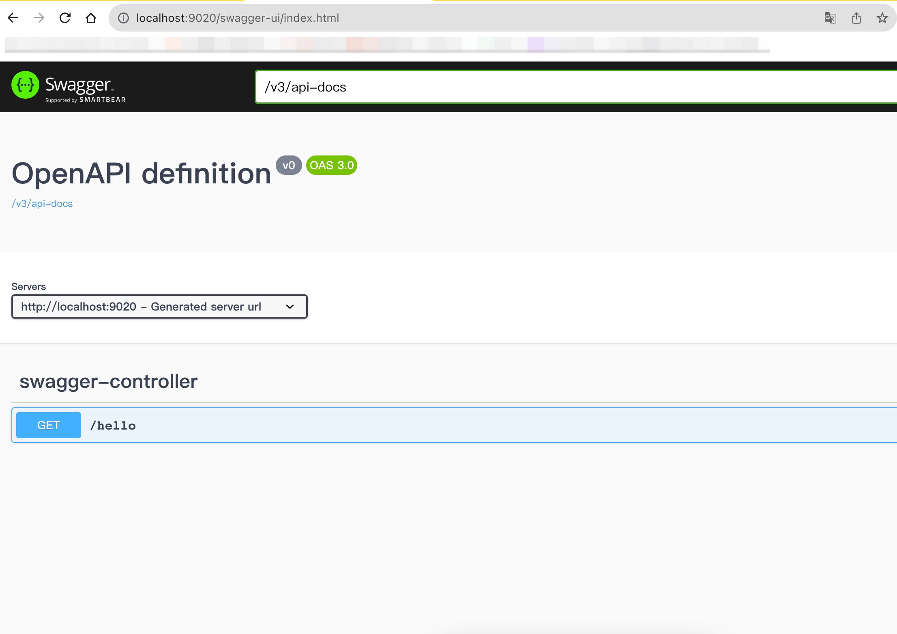

# spring_project_example
## 介绍
- 我使用的是 [SpringBoot 3.1.3](https://docs.spring.io/spring-boot/docs/3.1.3/reference/html/)，所以需要配置 JDK 17。  
- [spring_mvc_example](/spring_mvc_example) 模块是本项目其他 SpringBoot 模块的基础，该模块有 Spring MCV、Profiles、Testing 的示例代码，同时使用 Swagger UI 在浏览器调试 API。
- 运行 spring_mvc_example 模块主类，点击 http://localhost:9020/swagger-ui/index.html 就可以使用 Swagger UI 在浏览器调用 API，如下图

